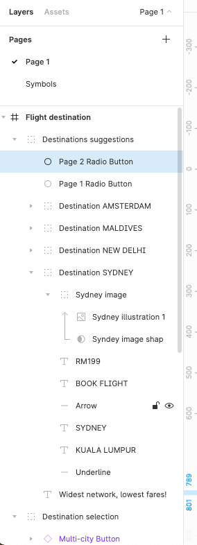
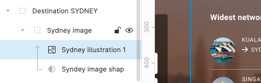

[Example here](https://www.figma.com/file/D6HC3Su97UQPfGIOmG0Yll/UI-Challenge-I---UI-Ex-9)

Make sure: 

- The screen designed matches the image
- All layers have a name and belong to a group of graphic elements
    
    
    

- There are 2 pages: one for the screen and one with the symbols
    
    
    
    

- Masks were used to change the shape of the image
    
    
    

- The overlay is done with transparency
    
    
    
    