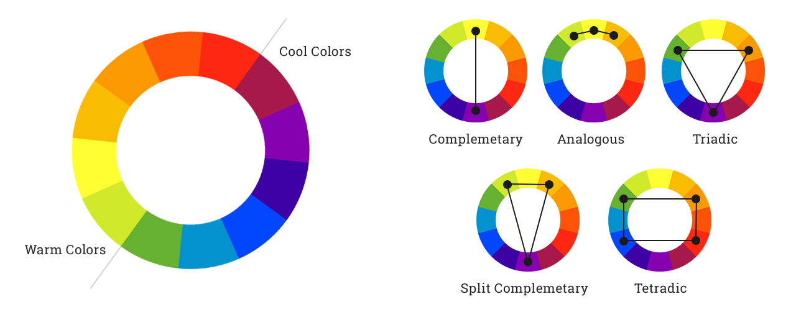

# UI I - Ex 3 - Color combinations

**Instructions:** 

Let's browse! 

Find 3 digital products (websites or apps) that use each kind of color palette combination: 

- Monochromatic
- Analogous
- Complementary
- Split complementary
- Triadic
- Double complementary

**Deliverable:** 

- A PDF document extracted from a Figma file including for each
    - screenshots of the main page
    - the matching URL
    - the main colors and
    - the kind of color combination.

**Tips:** 

- You can find HSB (Hue, Saturation, Brightness) as well as HSV (Hue, Saturation, Value) depending of the source.

**Resources:** 

- [https://coloursandmaterials.wordpress.com/2014/09/16/colour-system/](https://coloursandmaterials.wordpress.com/2014/09/16/colour-system/)
- 

**Monochromatic examples:** 

- [https://www.benefitcosmetics.com/](https://www.benefitcosmetics.com/) 
- [http://www.jwilouvres.com.au/](http://www.jwilouvres.com.au/) 
- [http://blank.com.pt/](http://blank.com.pt/)

**Analogous examples:**

- [https://www.natuurenmilieu.nl/](https://www.natuurenmilieu.nl/) 
- [https://campesinorum.com/](https://campesinorum.com/) 
- [https://www.lobster.es/](https://www.lobster.es/)

**Complementary examples:**

- [https://www.rolandgarros.com/](https://www.rolandgarros.com/fr-fr) 
- [https://squilla.io/](https://squilla.io/) 
- [https://gomim.com/en/](https://gomim.com/en/)

**Split complementary examples:**

- [https://flythenest.io/en/](https://flythenest.io/en/) 
- [https://www.kineuphorics.com/](https://www.kineuphorics.com/) 
- [https://www.ma-tea.de/](https://www.ma-tea.de/)

**Triadic examples**

- [https://normalnow.com/](https://normalnow.com/) 
- [https://brainbakery.com/en/](https://brainbakery.com/en/) 
- [https://www.barkbox.com/](https://www.barkbox.com/)

**Dual complementary or Tetradic examples**

- [https://www.airtable.com/](https://www.airtable.com/) 
- [https://calendar.google.com/](https://calendar.google.com/) 
- [https://www.ebay.com/](https://www.ebay.com/)
