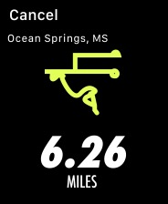

# UI I - Ex 8 - UI Challenge - Watches

**Instructions:** 

Copy these images on Figma

**Deliverable:** 

- A Figma file with a copy of the image with Figma elements
- Make sure:
    - You use symbols and variants
    - All your layers are named and organized
    - You use overlays
    - You use masks to change the shape of the imported image

**Tips:** 

- Fonts: SF Compact for the iOS elements,  Futura STD Condensed for the Nike signs
- The frame for each iWatch screen is watch 44 mm 184 x 224
- [Figma article about Symbols and Variants](https://help.figma.com/hc/en-us/articles/360056440594-Create-and-use-variants)
- You can use existing Libraries by browsing the Figma community resources