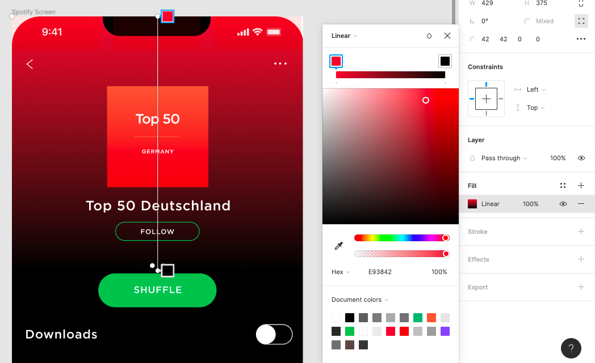

[Example here](https://www.figma.com/file/kzc8YNUZsPrcTNrdMt6aLX/UI-Challenge-I---UI-I-Ex-8)

Make sure

- The screen designed matches the image
- There are 2 pages: one for the screen and one with the symbols
    
    
    
- The background is made with linear color function
    
    