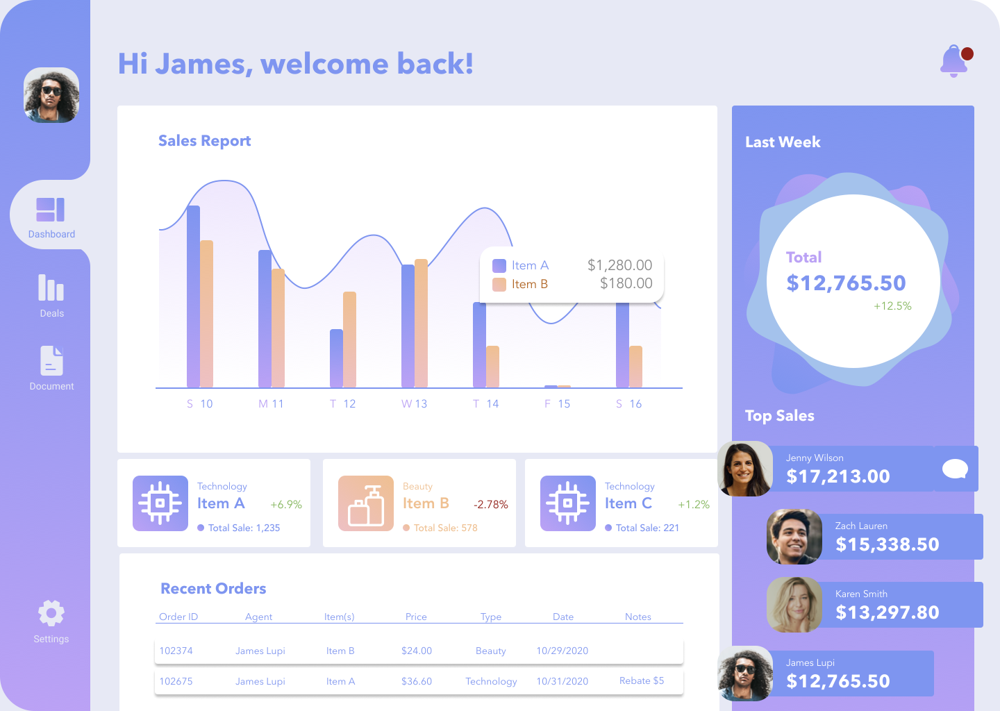

# UI I - Ex 11 - UI Challenge - Bitcoin Dashboard

**Context:** 

This first UI quest is a series of exercises to practice colors, moodboards, typography and replicate screens on Figma!

**Instructions:** 

Copy this image on Figma

**Deliverable:** 

- A Figma file with a copy of the image with Figma elements
- Make sure:
    - You use symbols and variants
    - All your layers are named and organized
    - You use overlays
    - You use masks to change the shape of an imported image
    - You use linear color function

**Tips:** 

- Fonts: Avenir
- The frame is a desktop 1440 x 1024
- [Figma article about Symbols and Variants](https://help.figma.com/hc/en-us/articles/360056440594-Create-and-use-variants)
- You can use existing Libraries by browsing the Figma community resources
