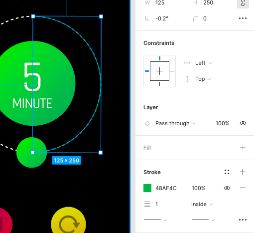

#### Audit instructions

##### Open the Figma file and inspect it. 

Make sure: 

###### There are two half circles as this one.
    
   
    
###### All the layers are labeled and organized in groups
    
    

##### [Example here](https://www.figma.com/file/LRgyZDBVgIq3PzjewTKI2c/UI-Challenge-I---UI-I-Ex-7)